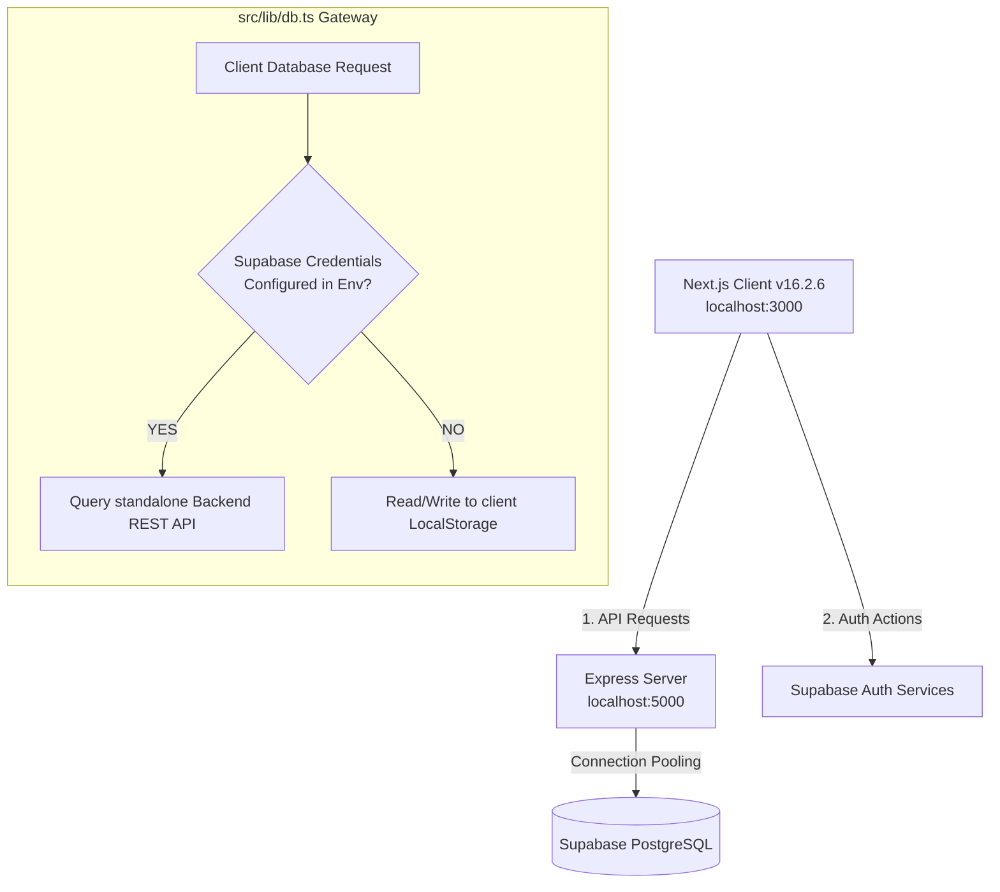

# 🌌 The Youth Prism (TYP)

[](https://nextjs.org/)
[](https://react.dev/)
[](https://expressjs.com/)
[](https://threejs.org/)
[](https://supabase.com/)
[](https://tailwindcss.com/)
[](https://www.typescriptlang.org/)

> **Where the Youth Lens Meets Global Geopolitical Power.**  
> *A premium, high-fidelity digital publication and intelligence platform covering technology, policy, healthcare equity, and foreign affairs. Curated, designed, and managed by young thinkers worldwide.*

---

## 📖 Table of Contents
1. [Overview](#overview)
2. [Features](#features)
3. [Screenshots & Preview](#screenshots--preview)
4. [Tech Stack](#tech-stack)
5. [Architecture](#architecture)
6. [Project Structure](#project-structure)
7. [Prerequisites](#prerequisites)
8. [Installation](#installation)
9. [Environment Variables](#environment-variables)
10. [Running Locally](#running-locally)
11. [Build Instructions](#build-instructions)
12. [Deployment](#deployment)
13. [Database Design](#database-design)
14. [API Documentation](#api-documentation)
15. [Design System](#design-system)
16. [Performance Optimizations](#performance-optimizations)
17. [Accessibility](#accessibility)
18. [Security](#security)
19. [Roadmap](#roadmap)
20. [License](#license)
21. [Credits](#credits)

---

## 🔍 Overview

**The Youth Prism (TYP)** is a premium, flagship digital publication and intelligence hub. Designed to compete visually and content-wise with global intelligence magazines like *Foreign Affairs*, *Bloomberg*, and *National Geographic*, it combines an immersive reader experience with a feature-rich, administrative dashboard panel. 

The platform operates on a decoupled architecture, serving public article feeds, Opportunities desks, Guided Pathways, and live marquee despatches, backed by a Node/Express REST API and Supabase (PostgreSQL) database.

---

## ✨ Features

### 📰 Public Intelligence Magazine
* **Interactive 3D WebGL Earth:** Rebuilt from scratch using `Three.js` (WebGL). Features realistic NASA Blue Marble topographic/diffuse textures, volumetric cloud mesh rotation, Rayleigh scattering atmospheric halo, and dynamic GLSL day/night lights shading. It supports momentum drag, autospining, and smooth slerp camera transitions centering USA, China, or India to filter active articles.
* **Scroll-Reactive Hero Prism:** A custom Canvas-rendered 3D glass prism acting as the page centerpiece. Employs real-time vector calculations to simulate incoming white light, internal refraction, and scroll-bound chromatic dispersion (rainbow spectrum).
* **Living Newsroom & Marquee:** An animated horizontal marquee displaying current geopolitical briefs alongside an expandable briefing ribbon.
* **Focus Ecosystem Graph:** An interactive, vector-based SVG network graph representing relational links between core sectors (Technology &rarr; Policy &rarr; Geopolitics &rarr; Economics &rarr; Healthcare). Shows animated directional signals and information cards on hover.
* **Guided Reading Pathways:** Interactive sequences allowing readers to progress through article syllabi (e.g. *Understanding AI Governance*) with checked milestones and progress metrics.
* **Publications Bookshelf:** An immersive digital bookshelf at `/publications` showcasing printed cover cards, alongside a scroll-based layout reader at `/publications/[slug]` with pull quotes, indices, and footnotes.
* **Opportunities & Collective Desks:** Curated fellowship lists at `/opportunities` supporting deadline indicators and category tags, and team rosters at `/team` with desk filters.

### 🛡️ Administrative Control Panel (`/admin`)
* **Analytics Center:** Dynamic analytics tracking total views, published/draft ratios, categories, and subscriber counts.
* **WYSIWYG Composer:** Article compiler supporting drafts, publishing schedules, tags, categories, cover images, and direct SEO title/description overrides.
* **Subscriber Campaigns:** Composes and dispatches formatted HTML newsletters to all subscribers in the database with a single click.
* **Taxonomy & Settings Editor:** Interfaces to manage categories, tags, authors, and global site configurations (social configurations, reader stats, and metadata).

---

## 📸 Screenshots / Preview

*To preview local layouts, execute the setup guidelines below. Screenshots of critical centerpieces include:*

### 1. Cinematic 3D Earth WebGL Globe
The 3D Globe renders a realistic Earth sphere complete with night-light arrays dynamically blending at the day/night terminator:


### 2. Chromatic Dispersion Prism
The hero section utilizes an optical refraction canvas to create an immersive, premium digital-magazine fold:


---

## 🛠 Tech Stack

### Frontend Client (Root)
* **Framework:** Next.js `16.2.6` (App Router, Server-rendered layout)
* **Library:** React `19.2.4` (Concurrent client/server rendering hooks)
* **Styling:** Tailwind CSS `v4` & Custom Vanilla CSS overrides
* **3D WebGL Rendering:** Three.js `0.184.0` (Standard Renderer, Custom GLSL Shaders)
* **Animation:** Framer Motion `12.40.0` (Micro-animations and layout easing)
* **Iconography:** Lucide React `1.17.0`

### Backend Server (`/backend`)
* **Runtime:** Node.js Express.js `4.19.2`
* **Limiter:** Express Rate Limit `8.5.2` (IP rate limiting for endpoints)
* **Database Driver:** pg `8.11.5` (PostgreSQL Client Pool)
* **Process Monitor:** Nodemon `3.1.0` (Development auto-reload)

### Database & Security
* **Database Engine:** Supabase PostgreSQL Database (Relational storage, triggers, functions)
* **Authentication:** Supabase Auth (JWT bearer-token verification)
* **Access Control:** Row Level Security (RLS) Policies on PostgreSQL

---

## 📐 Architecture

The application is deployed as a decoupled monorepo. It features a hybrid database routing layer designed for local-first testing and zero-config previews.



### 1. Hybrid Database Gateway (`src/lib/db.ts` & `backend/db.js`)
If remote environment variables are omitted, both frontend and backend automatically fall back to localized caching databases (HTML5 `localStorage` for frontend client; file-based `local_db.json` for standalone backend). This guarantees instant execution out of the box without prior cloud database setups.

### 2. Lock-Step Authentication
Admin dashboard routes are protected at the frontend router boundary and verified at the backend handler level using JWT bearer tokens verified against Supabase Auth endpoints.

---

## 📂 Project Structure

```
typ/
├── backend/                  # Standalone API Server (Express.js)
│   ├── .env.example          # Backend sample environment variables
│   ├── db.js                 # PostgreSQL Client Pool & local JSON DB fallback
│   ├── local_db.json         # Standalone file-system fallback database
│   ├── package.json          # Node server dependencies & run scripts
│   └── server.js             # REST endpoints & middleware routing
├── public/                   # Static assets (favicons, manifest files)
├── src/
│   ├── app/                  # Next.js App Router Pages
│   │   ├── about/            # Philosophy, mandate & manifesto
│   │   ├── admin/            # Dashboard stats, editor, settings, campaigns
│   │   ├── articles/         # Article indexes & dynamic layouts
│   │   ├── categories/       # Category desks lists
│   │   ├── team/             # Team collective and author list
│   │   ├── globals.css       # Tailwind 4 directives and design tokens
│   │   ├── layout.tsx        # Base document layout & custom font imports
│   │   └── page.tsx          # Homepage layout
│   ├── components/           # Core visual modules (3D Globe, Node Graph, Prism)
│   ├── context/              # Context Providers (Auth, Locked Theme)
│   ├── lib/                  # Database interface wrappers & utils
│   └── types/                # TypeScript interface contracts
├── DEPLOYMENT.md             # Production deployment procedures
├── supabase-schema.sql       # PostgreSQL Database table schemas & RLS policies
├── package.json              # Client packages and scripts
└── tsconfig.json             # TypeScript compiler settings
```

---

## 📋 Prerequisites

Ensure you have the following software packages installed locally:
* **Node.js:** `v18.0.0` or higher (recommended: `v20.x` LTS)
* **npm:** `v9.x` or higher
* **Git:** For version control tracking

---

## ⚙️ Environment Variables

Copy the corresponding template configs in client and backend directories to configure environment connections.

### Frontend Client Settings (`/.env.local`)
Create `/.env.local` in the root folder:

| Variable | Description | Default Fallback |
| :--- | :--- | :--- |
| `NEXT_PUBLIC_BACKEND_URL` | Public URL of the backend Express server | `http://localhost:5000` |
| `NEXT_PUBLIC_SUPABASE_URL` | URL endpoint of the Supabase project | *Optional (Falls back to LocalStorage)* |
| `NEXT_PUBLIC_SUPABASE_ANON_KEY` | Anonymous key of the Supabase database | *Optional (Falls back to LocalStorage)* |

### Backend API Settings (`/backend/.env`)
Create `/backend/.env` in the `/backend` folder:

| Variable | Description | Default Fallback |
| :--- | :--- | :--- |
| `PORT` | Listening port of the Express server | `5000` |
| `DATABASE_URL` | PostgreSQL connection string (Supabase Connection Pooler) | *Optional (Falls back to local_db.json)* |
| `SUPABASE_URL` | Supabase API endpoint for JWT authentication checks | *Optional (Allows mock-admin-token in local)* |
| `SUPABASE_ANON_KEY` | Supabase anon key for header validation | *Optional (Allows mock-admin-token in local)* |

---

## 🚀 Running Locally

You can run both client and server locally using concurrent terminal processes.

### 1. Setting Up the Frontend Client
Open your terminal in the root directory:
```bash
# Clone the repository
git clone https://github.com/Rapolucharankumar/TYP.git
cd typ

# Install dependencies
npm install

# Run the Next.js development server
npm run dev
```
Navigate to [http://localhost:3000](http://localhost:3000).

### 2. Setting Up the Backend Server
Open a second terminal window in the `/backend` directory:
```bash
# Change to backend directory
cd backend

# Install dependencies
npm install

# Run the API server in development mode (with nodemon auto-refresh)
npm run dev
```
The server will bind to [http://localhost:5000](http://localhost:5000). You can check health status at `/api/health`.

### 3. Mock Administrator Credentials
If database configs are omitted, you can access the admin dashboard at `/admin` using these credentials:
* **Email:** `admin@youthprism.com`
* **Password:** `admin123`

---

## 🏗️ Build Instructions

To build the client and backend for deployment or validation:

### Compile Client Production Bundle
```bash
# In the root folder
npm run build
```
This commands runs `next build` to verify TypeScript typings, compile page routes, optimize assets, and output static/dynamic server targets under the `.next` directory.

### Compile Backend Output
The Express backend is constructed using native CommonJS. You can run checks directly using:
```bash
# In the /backend folder
node server.js
```

---

## 🚢 Deployment

The platform is designed to be hosted on high-availability cloud platforms. Detailed instructions are configured in [DEPLOYMENT.md](file:///c:/Users/rapol/OneDrive/Desktop/typ/DEPLOYMENT.md).

* **Frontend Client:** Deployed to **Vercel** pointing to the root directory `./` (binds environment variables for `NEXT_PUBLIC_BACKEND_URL`).
* **Backend API Server:** Deployed to **Railway** or **Render** pointing to the subdirectory `backend` as the root directory (binds environment variables for `DATABASE_URL` postgres connection).
* **Database & Auth:** Structured on **Supabase** ( Singapore Region pooler recommended for low latency).

---

## 🗄️ Database Design

The relational database is configured on Supabase. Execute [supabase-schema.sql](file:///c:/Users/rapol/OneDrive/Desktop/typ/supabase-schema.sql) in your database query editor to initialize schemas.

```
                  ┌──────────────────────┐
                  │       profiles       │
                  ├──────────────────────┤
                  │ PK  id               │
                  │     email            │
                  │     role             │
                  └──────────┬───────────┘
                             │ (1 : 1)
                  ┌──────────▼───────────┐
                  │       authors        │
                  ├──────────────────────┤
                  │ PK  id               │
                  │     name             │
                  │     bio, avatar      │
                  │     social_links     │
                  └──────────┬───────────┘
                             │ (1 : N)
 ┌────────────────┐          │           ┌────────────────┐
 │   categories   │◄─────────┼──────────►│    articles    │
 ├────────────────┤ (1 : N)  │  (N : 1)  ├────────────────┤
 │ PK  id         │          │           │ PK  id         │
 │     name, slug │          │           │     title, slug│
 │     description│          │           │     excerpt    │
 └────────────────┘          │           │     content    │
                             │           │     status     │
                             │           │     views      │
                             │           └───────┬────────┘
                             │                   │ (N : M)
                    ┌────────▼───────┐  ┌────────▼───────┐
                    │  opportunities │  │  article_tags  │
                    ├────────────────┤  └────────┬───────┘
                    │ PK  id         │           │
                    │     title, type│  ┌────────▼───────┐
                    │     deadline   │  │      tags      │
                    │     stipend    │  ├────────────────┤
                    └────────────────┘  │ PK  id         │
                                        │     name, slug │
                                        └────────────────┘
```

---

## 🔌 API Documentation

All routes expect header payloads: `Content-Type: application/json`. Authorized routes expect bearer credentials: `Authorization: Bearer <token>`.

### Public Endpoints
* `GET /api/health` - Health status check.
* `GET /api/articles` - Retrieve all articles in the system.
* `GET /api/articles/:slug` - Retrieve detailed article by slug index.
* `POST /api/articles/:id/view` - Increment the view counter.
* `GET /api/authors` - Retrieve writing collective roster.
* `GET /api/categories` - Retrieve all categories.
* `GET /api/categories/:slug` - Retrieve category details by slug.
* `GET /api/tags` - Retrieve all tags.
* `GET /api/opportunities` - Retrieve opportunities board items.
* `POST /api/subscribers` - Sign up new subscriber to newsletter.

### Authorized Endpoints (Admin JWT Required)
* `POST /api/articles` - Compile new article.
* `PUT /api/articles/:id` - Update existing article.
* `DELETE /api/articles/:id` - Remove article.
* `POST /api/authors` - Add new writer to collective.
* `PUT /api/authors/:id` - Update author profile.
* `DELETE /api/authors/:id` - Remove author profile.
* `POST /api/opportunities` - Add opportunity post.
* `PUT /api/opportunities/:id` - Update opportunity post.
* `DELETE /api/opportunities/:id` - Remove opportunity post.
* `GET /api/subscribers` - Retrieve subscribers list.
* `POST /api/campaigns` - Dispatch email newsletter campaign to all subscribers.
* `PUT /api/settings` - Modify site configurations.

---

## 🎨 Design System

Aligned with the **Brand Book 2025** guidelines, TYP forces a high-contrast dark space look across the application.

### ✒️ Typography
* **Primary Editorial Serif:** `Playfair Display` (`--font-playfair`) - Used for headliners, masthead logo lockups, and feature titles.
* **Secondary Editorial Serif:** `Cormorant Garamond` (`--font-cormorant`) - Used for pull quotes, reading pathway details, and footnotes.
* **Modern Sans-Serif:** `Inter` (`--font-inter`) - High-legibility geometric face configured for body copy, controls, and navigations.

### 🎨 Color Palette
Tailored utilizing modern CSS variables for a dark-first premium ambiance matching Brand Book 2025:
* **Midnight Background:** `#0F172A` (Forced globally on document root).
* **Card Panels:** Midnight 2 `#1a2540` & Midnight 3 `#243050`.
* **Primary Accent:** Lavender `#E6DDF7`.
* **Secondary Accent:** Butter Gold `#F7E7A1` & Teal `#BDE7D9`.
* **Warning/Alert:** Cherry Red `#E45757`.

---

## ⚡ Performance Optimizations

* **State Ref Bypass (Three.js):** Custom canvas vectors, target camera angles, and uniforms bypass the React state updates cycle by binding values directly to mutable references (`useRef`). This prevents canvas re-mounts on user interactions, maintaining 60fps.
* **Optimized Font Loading:** Next.js font packages retrieve optimized sub-sets, mapping CSS variables directly inside the Tailwind compilation stream.
* **Cold Start Recovery:** Express routing requests use custom AbortControllers with a 12-second timeout window, prompting fallback mock data instantly if servers are cold starting.

---

## ♿ Accessibility

* **Semantic Elements:** Coded using HTML5 tags (`<header>`, `<nav>`, `<main>`, `<article>`, `<footer>`).
* **Labeling:** Interactive components use specific `aria-label` definitions (e.g. Navigation tags and custom control components).
* **Typographic Hierarchy:** Layout structures contain exactly one `<h1>` per page with sequential header scaling (`<h2>` through `<h5>`).

---

## 🔒 Security

* **Rate Limiting:** Backend endpoints are rate-limited via `express-rate-limit`:
  * Read endpoints: 100 requests per 15 minutes per IP.
  * Write/mutation endpoints: 20 requests per 15 minutes per IP.
* **Row Level Security (RLS):** Supabase database tables enforce strict RLS rules, limiting write permissions to authorized tokens while allowing public read access.
* **CORS:** Cross-Origin Resource Sharing is locked down to permitted URLs, blocking arbitrary source queries.

---

## 🗺️ Roadmap

- [ ] Multi-lingual translation desks (Spanish, French, Mandarin, Arabic).
- [ ] Direct RSS feeds connection capabilities.
- [ ] Native audio speech rendering option for long essays.
- [ ] Print issue PDF compiler inside the Admin dashboard.

---

## 📄 License

Distributed under the MIT License. See `LICENSE` for more information.

---

## 🤝 Credits

* **NASA Blue Marble:** Diffuse, Night-lights, and normal sphere topography textures.
* **Three.js Contributors:** WebGL rendering loop models.
* **Google Fonts:** Inter, Playfair Display, and Cormorant Garamond typography.
* **Unsplash:** Editorial cover backgrounds and vector portraits.

---
*Copyright © 2026 The Youth Prism (TYP). All rights reserved.*
